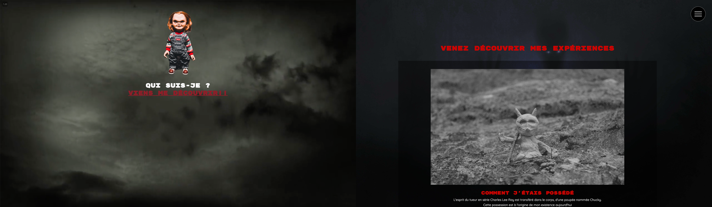
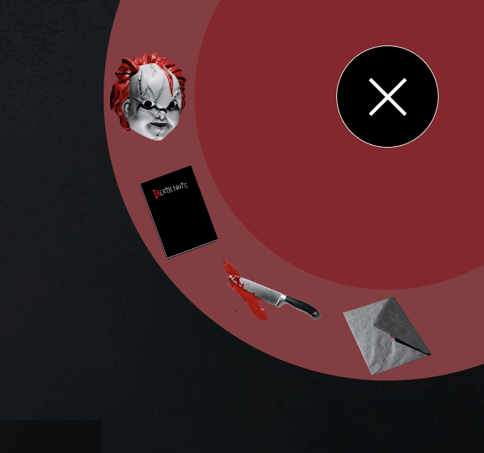

# Projet 1 de portfolio Chucky

Ce projet était accés sur la mise en avant du Portfolio d'un personnage connu et malifique. Le projet "Chucky" était une réalisation en front-end mettant en avant la face cachée du personnage Chucky. L'objectif était de créer une expérience interactive engageante en mettant en lumière les aspects sombres et mystérieux de Chucky, tout en démontrant des compétences approfondies en développement front-end.

## Développement du Site

### Collaboration de 4 personnes | Durée de création : 3 semaines

Dans le cadre de ce projet, une équipe de 4 personnes passionnées s'est réunie pour créer un site portfolio pour le personnage chucky Doll. Chaque membre de l'équipe avait un rôle spécifique défini afin de maximiser l'efficacité de notre collaboration.

Nous avons travaillé en étroite collaboration pendant une période de 3 semaines, en mettant en application nos connaissances techniques acquises dans les domaines du PHP, du CSS et du HTML en rajoutant de l'intéraction avec du Javascript pour développer un site portfolio.

### Objectif du site

Notre objectif principal était de fournir un site portfolio pertinent et efficace pour Chucky Doll afin qu'il puisse montrer ses qualités et ses compétences maléfiques.

### Critères obligatoires

- La réalisation du projet en 3 semaines.
- Site totalement Responsive.
- Utilisation d'un gestionnaire de tâche pour la coordination de l'équipe.
- Chaque membre de l'équipe devrait au minimum fournir une page HTML et CSS.
- Avoir une charte graphique cohérente et en adéquate avec le personnage.
- Utilisation de git pour une collaboration optimale et fluide. 

### Travail personnel

Après le partage de travail prévu par le groupe, je me suis occupé de la page d'attérissage en mettant une vidéo et un audio, et aussi le menu burger qui est circulaire au click et aussi la page expériences qui contient des cartes avec une photo et du texte en full responsive.

### Travail personnel en images:

Page d'attérrissage et page expériences 

Menu burger circulaire

## Accomplissement collaboratif de l'équipe

Grâce à notre collaboration collective fructueuse, nous avons pu concrétiser les fonctionnalités suivantes :

- Développement des pages home / profil / compétences / contact.
- Création du footer.
- Fichiers CSS et JS.

## Technologies Employées

- HTML/CSS
- Javascript
- PHP
- Git/GitHub

### Quelques images du projet

- Les pages accueil / qui suis-je / compétences / contact:

___

#### Pour une meilleure visualisation du projet, le téléchargement est nécessaire.

___

## Me contacter

Pour plus de renseignements contactez-moi sur [LinkedIn](https://www.linkedin.com/in/fouadtebi/), je suis plus réactif.

**Merci**.

